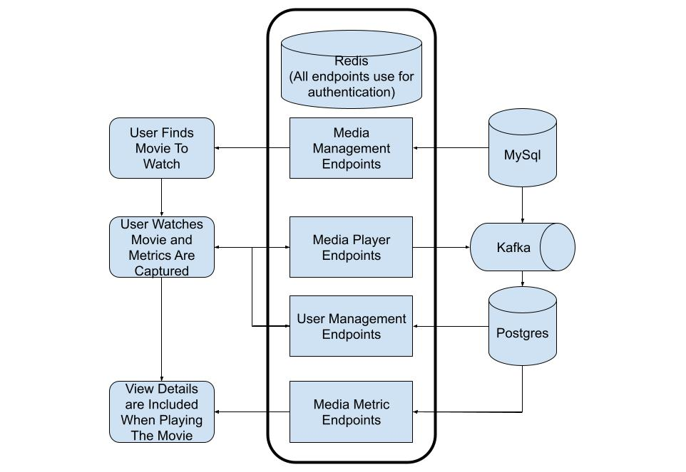

# Interview environment

<!-- TOC -->
* [Interview environment](#interview-environment)
  * [Introduction](#introduction)
  * [Quick start](#quick-start)
    * [Requirements](#requirements)
      * [MAC](#mac)
      * [PC](#pc)
  * [What the application does](#what-the-application-does)
  * [Gradle Submodules](#gradle-submodules)
    * [Media Player Workflow](#media-player-workflow)
  * [Assumptions](#assumptions)
  * [IDE Setup](#ide-setup)
  * [Running the application](#running-the-application)
    * [Run the full stack](#run-the-full-stack)
  * [Interacting with the application](#interacting-with-the-application)
    * [Running an appliction via `bootrun`](#running-an-appliction-via-bootrun)
    * [User Management Endpoint](#user-management-endpoint)
    * [Media Management Endpoint](#media-management-endpoint)
    * [Media Metrics Endpoints](#media-metrics-endpoints)
    * [Media Comments Endpoints](#media-comments-endpoints)
  * [Spring Boot Conventions](#spring-boot-conventions)
  * [MYSQL](#mysql)
  * [POSTGRES](#postgres)
    * [Connect](#connect)
    * [Helper Functions](#helper-functions)
      * [List Tables](#list-tables)
      * [List All Users](#list-all-users)
      * [List All Episodes](#list-all-episodes)
    * [Add kafka_sink to search path](#add-kafka_sink-to-search-path)
  * [Kafka](#kafka)
  * [Framework Documentation](#framework-documentation)
    * [Reference Documentation](#reference-documentation)
    * [Guides](#guides)
    * [Additional Links](#additional-links)
<!-- TOC -->

## Introduction

The purpose of this repo is to provide the following information
* Provides examples of monorepo architecture for small/medium sized project
* Demonstrate module setup to allow for parallel development between multiple developers in a single repo
* Provide example of integration tests with separate executables each defined in it's own submodule. See [IntegrationTests](integration-tests/README.md)
* Demonstrate basic knowledge in a variety of technologies and frameworks
* Demonstrate the usefulness of Docker Compose
* Provide a template to try new technologies

This environment does not cover the following as these are tasks that can be worked in parallel and under normal circumstances would be given to another developer to perform
* Deployment best practices
* Indexes in databases
* Optimal algorithms for some operations
* Debug Ports on test containers
* UI error handling

## Quick start

### Requirements
* Java 21 
  * older version chosen intentionally to reduce problems as people are often slow to migrate version
* Docker 
  * Development was done with orbstack
* npm
  * Required for typescript sdk builders 


The following scripts does the following
1) build jars
2) start docker compose
3) start npm locally
4) tear down the docker compose file when npm has stopped


#### MAC
This has been tested and is how this developer does quick spot checks that everything is working as intended
```shell
./run_locally.sh
```

#### PC
This has not been tested as i do not have a pc to test against.  Based on documentation the bellow should work
```shell
./run_local.bat
```


Start ui locally
```shell
cd media-player-ui;
npm install;
npm start;
```

Actions from the ui
1. Set the bearer token 123 (will redirect you to the qa page)
2. Generate Users
   - Optionally you can generate a movie, though the application starts with one.
3. log in as a user (It will redirect you to the series tab)
   - Users can be found on the user tab
   - When generating a user, a login button will appear allowing you to login as the user you just made.
4. press play on a movie of your choice 
   - this will redirect you to the movie which will automatically play
5. press stop
6. The number of views and total view time should now be updated to show 
   - You may need to press stop or play the first time as the kafka consumer may be slow consuming the first message.


## What the application does
This is a mock application for a netflix like company.

This is a monorepo with several executables required to do the following
* Manage Users.  See [Users](libs/users/README.md) for user structures
* Manage TvSeries/movies (Does not actually store media files as part of this demo). See [Series](libs/series/README.md) for definitions
* Capture Metrics on viewers viewing habits (how long was a viewing session, how many episodes etc)

## Gradle Submodules

This is a composite Gradle build. Each includeBuild is an independent module that can be developed and built in parallel:

| Module                                           | Description                                                                                                                    |
|--------------------------------------------------|--------------------------------------------------------------------------------------------------------------------------------|
| [apps](apps/README.md)                           | Java Applications                                                                                                              |                                                                                                             |
| [drivers](drivers/README.md)                     | Drivers and conventions for third party applications. For example, kafka, and mysql.                                           |
| [libs](libs/README.md)                           | Domain logic modules (avro-model, series, users)                                                                               |
| [util](util/README.md)                           | Shared utilities ([java-core](util/java-core/README.md) for plain Java, [spring-util](spring-util/README.md) for Spring beans) |
| [gradle-plugins](gradle-plugins/README.md)       | Custom Gradle plugins that define build convention and logic                                                                   |
| [media-player-ui](media-player-ui/README.md)     | TypeScript UI application                                                                                                      |
| [qa-endpoint-root](qa-endpoint-root/README.md)   | QA-specific endpoint modules                                                                                                   |
| [test-data](test-data/README.md)                 | Test data generation utilities                                                                                                 |
| [integration-tests](integration-tests/README.md) | All integration tests (built as a regular include, not includeBuild)                                                           |

All `./gradlew` commands must be run from the root directory.

### Media Player Workflow
When the application plays some media it interacts with the backend system in the following manner.


## Assumptions

* This is not intended to be replace the interview process.
* Shows how to setup a project in a way where work can be parallelized between multiple developers.

## IDE Setup

It is recommended that you set your ide to run `./gradlew clean` task before it runs `./gradlew test`.  This is because integration tests require the fat jars produced by other submodules, and an elegant way to handle that automatically has not been setup yet. 

## Running the application

You can run the application two ways.  One with h2 as the database, and secondarily with mysql as the database.

### Run the full stack

Build jars
```shell
./gradlew clean bootJar
```

Build Images and run all applications
```shell
docker compose -f docker-compose.yml -f docker-compose.fixedport.yml -f docker-compose.stack.yml -f docker-compose.stack.fixedport.yml up -d --build 
```

Build Images and run all dependencies on fixed ports
```shell
docker compose -f docker-compose.yml -f docker-compose.fixedport.yml up -d --build 
```


NOTE:
Currently the docker files compose files are kept in two file to allow running `docker-compose up` and running locally for debugging purposes.   

Documentation on running the apps in this manner has been removed until correct profiles are created to handle local development again

## Interacting with the application

[Run the entire stack](#quick-start)

You can use a bearer token of `123` to act as an admin user.

There are links to swagger documentation in each [apps](./apps) `README.md` file.

### Running an application via `bootRun`

This should be fixed when `.env` is removed from being used by the `docker-compose` files as they are not necessary.

## Spring Boot Conventions

This application provides a collection of submodules to act as opinionated setup for connecting with items such as drivers to connect to a third party library or modules on how the database is setup.

In order to quickly connect with these opinionated pieces, you should have the following in your application at a minimum
```java
@SpringBootApplication(scanBasePackages = {"org.amoeba.example"})
public class YourApplication {

  public static void main(String[] args) {
    SpringApplication.run(YourApplication.class, args);
  }

}
```

## MYSQL

To connect to the database run the following
```shell
docker exec -it interview-mysql-1 mysql
```

some helpful commands

If you are unfamiliar with mysql the show command is helpful.
```mysql
show databases;
```

To view all series run
```mysql
select * from series.series;
```

## POSTGRES

### Connect
to connect to postgres 
```shell
docker exec -it interview-postgres-1 psql media --u user
```

### Helper Functions

#### List Tables
```postgresql
\dt
```

#### List All Users
```postgresql
select * from users.external_user;
```

#### List All Episodes
```postgresql
select * from kafka_sink.mysql_series_episode;
```

### Add kafka_sink to search path
```postgresql
SET search_path TO kafka_sink, public;
```

## Kafka
// TODO
Creating a topic

## Framework Documentation
This was generated via the [start.spring.io](https://start.spring.io/) 

### Reference Documentation
For further reference, please consider the following sections:

* [Official Gradle documentation](https://docs.gradle.org)
* [Spring Boot Gradle Plugin Reference Guide](https://docs.spring.io/spring-boot/docs/3.1.3/gradle-plugin/reference/html/)
* [Create an OCI image](https://docs.spring.io/spring-boot/docs/3.1.3/gradle-plugin/reference/html/#build-image)
* [Spring Web](https://docs.spring.io/spring-boot/docs/3.1.3/reference/htmlsingle/index.html#web)
* [Spring Data for Apache Cassandra](https://docs.spring.io/spring-boot/docs/3.1.3/reference/htmlsingle/index.html#data.nosql.cassandra)
* [Spring Data Reactive Redis](https://docs.spring.io/spring-boot/docs/3.1.3/reference/htmlsingle/index.html#data.nosql.redis)
* [Spring Boot Actuator](https://docs.spring.io/spring-boot/docs/3.1.3/reference/htmlsingle/index.html#actuator)
* [Spring cache abstraction](https://docs.spring.io/spring-boot/docs/3.1.3/reference/htmlsingle/index.html#io.caching)

### Guides
The following guides illustrate how to use some features concretely:

* [Building a RESTful Web Service](https://spring.io/guides/gs/rest-service/)
* [Serving Web Content with Spring MVC](https://spring.io/guides/gs/serving-web-content/)
* [Building REST services with Spring](https://spring.io/guides/tutorials/rest/)
* [Accessing data with MySQL](https://spring.io/guides/gs/accessing-data-mysql/)
* [Spring Data for Apache Cassandra](https://spring.io/guides/gs/accessing-data-cassandra/)
* [Messaging with Redis](https://spring.io/guides/gs/messaging-redis/)
* [Building a RESTful Web Service with Spring Boot Actuator](https://spring.io/guides/gs/actuator-service/)
* [Caching Data with Spring](https://spring.io/guides/gs/caching/)

### Additional Links
These additional references should also help you:

* [Gradle Build Scans – insights for your project's build](https://scans.gradle.com#gradle)
